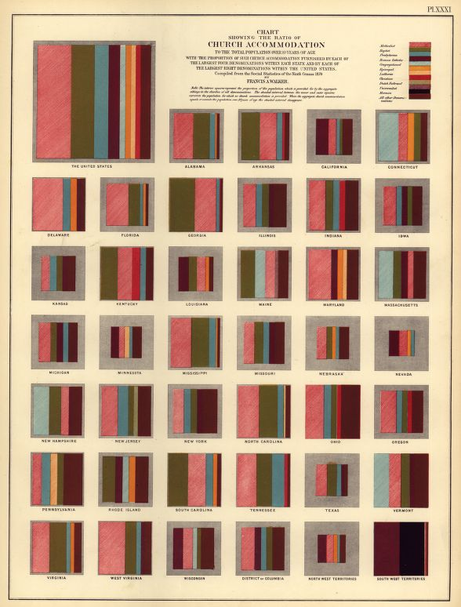
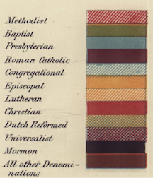
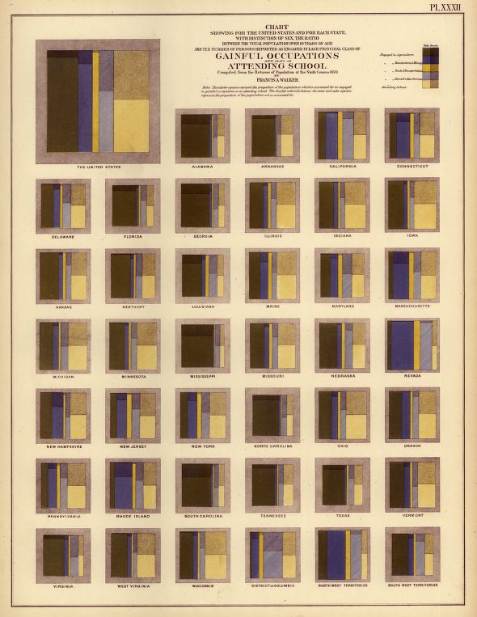
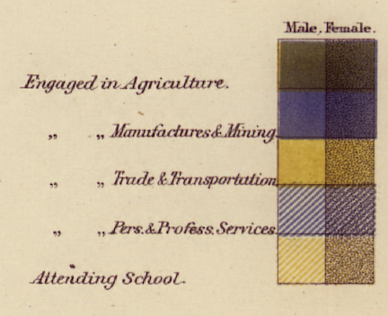
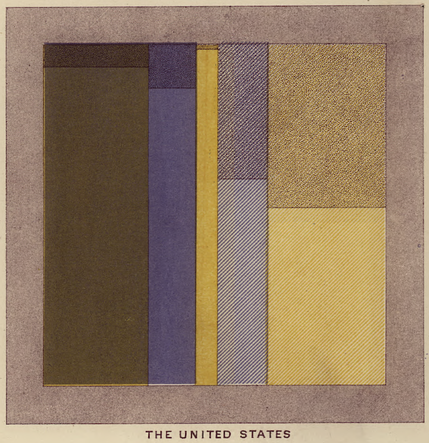

Introduction
===

Three times in the past, the US Census Bureau published a Statistical Atlas to map the state of the Union based on data collected in the 9th, 10th, and 11th US census (in 1870, 1880, and 1890). Each of these atlases represents a  masterpiece in science and technology. Here, we want to focus on the ninth Census, supervised by Francis A. Walker. At this time, the United States had a population of about 38.5 million people. The Atlas represents a graphical compendium of the census information prepared in more than 100 lithographic plates. Most of these plates are overlaid maps, but some consist of more abstract and, at that time, novel visualizations.
Of particular interest are plates #31 and #32. Both of these plates have a very similar structure: they show small multiples, one for each state, of what are now known as mosaic plots or  Marimekko charts.

At the time the Statistical Atlas for the ninth census was created, Mosaic plots were a novel way of visualizing data. Even though area plots as a means of visualizing data had been in use before [@friendly], e.g. Minard's [@minard] plate #3 [@newyork], Mosaic plots in their modern form  of use were not published until 1877 [@mayr]. However,  the descriptions given on both plates #31 and #32 makes it clear that areas are designed to be proportional to the population they represent: "The interior squares represent the proportion of the population which is accounted for as engaged in gainful occupations or as attending school. The shaded intervals between the inner and and outer squares represent the proportion of the population not so accounted for."


XXX What we are planning on doing here

1. *Discuss the charts:* 
2. *Recreate the charts:* that involves to get the data, check that it is the right data and re-create the charts (to the degree that modern charts will allow us to do that). In order to be able to check the data for correctness, we have to digitize the information provided in the chart (by measuring the relevant geometric objects).
3. *Re-display the data:* some of the visualization choices made in the original charts are cognitively questionable. Re-displaying the data also allows us to introduce a spatial component.

Both plates #31 and #32 are based on population totals for the population over 10 years of age. Because state-level aggregates of the number of total population above the age of ten are not available directly, we are making use of the 1\% microsample of the ninth census provided by the Integrated Public Use Microdata Series (IPUMS-USA) provided through the Minnesota Population Center [@ipums]. Using the small sample, we get counts of the male and female population above ten as well as state totals. This allows us to get estimates for the size of the male and female population above ten for each state by applying the proportions gained from the sample. 

## Chart Discussion
The charts in the Statistical Atlas were created using extremely high-precision methods for the time it was published. Color images were produced by Julius Bien's publishing house [@bien,@atlas-review] using lithography. This process involved creating separate plates for each color utilized in the chart by hand, and then lining up each color precisely when the images were printed. Modern methods are much quicker and easier on the visualization designer; we only have to write computer code to describe the plot, and the computer renders the plot in a miniscule fraction of the time it would take to draw the same plot by hand. 

Reproducible research is a frequent topic of discussion in data visualization and data science[@donoho-reproducible,@amstat-repro,@knitr,@leisch2002sweave]. This paper sets out to reproduce with as much fidelity as possible the hand-drawn charts of the Statistical Atlas, using modern methods. In some cases, reproducibility focuses on whether the results of a study can be replicated from the exact same data set using the same methods and computer code; this is not the approach we are taking in this paper. Rather, here we are exploring whether it is possible to access the data from the 1870 census (or a sample thereof) and, using that data, re-create some of the charts in the Statistical Atlas using modern methods. In addition to sampled data, we also extrapolate data from digitized versions of the original charts by measuring the geometric objects.

This study is intended to examine the persistence of data and methodology across nearly 150 years and several technological revolutions. As the study of statistical visualization has developed considerably over the past 147 years, we also examine the visualization decisions made for the 1870 statistical atlas and create improved graphics which more clearly display the same data. The technological advances since the 1870 census also allow us to more easily add a spatial component, as it is now much easier to display the census data in map form. These improvements allow us to add addiitonal depth to the 1870 statistical atlas graphics without investing hundreds of hours of artistic work for each additional map and chart. 


```{r data-reading, echo=FALSE, message=FALSE, warning=FALSE}
library(tidyverse)
occ2 <- read.csv("../Data/occ2.csv")
occ2 <- occ2 %>% mutate(
  Occupation = factor(Occupation, levels= c("Agriculture", "Manufacturing",
                                            "Trade", "Service", "School")),
  Gender = factor(Gender, levels=c("Male", "Female")),
  State = as.character(State),
  Area.Name = as.character(Area.Name)
)

occ3 <- read.csv("../Data/occ3.csv")
occ3 <- occ3 %>% mutate(
  Occupation = factor(Occupation, levels= c("Agriculture", "Manufacturing",
                                            "Trade", "Service", "School", "Unaccounted")),
  Sex = factor(Sex, levels=c("Male", "Female")),
  State = as.character(State),
  Area.name = as.character(Area.name)
)

px2 <- read.csv("../Data/px2.csv")
```

Plate #31: Church Accommodations
===

Figure \ref{fig:denominations} shows a miniature of plate #31 from the Statistical Atlas. This plate shows the percentage of religious sittings by denomination for each state (colored stripes in the square) as well as the percentage of unaccommodated population over the age of ten (area of the grey outer frame). For each state a square of the same size is drawn. The four most common denomination are shown as colored stripes, the width of which is proprtional to the number of their sittings. Each denomination is shown by one of eleven different colors, all other denominations are represented jointly by a twelfth color. The color scheme chosen in the Statistical Atlas is essentially that of paired colors, i.e. each hue is represented with a lighter shade (using hatching) and a darker shade (see zoom-in to the legend of plate #31 in figure \ref{fig:legend-31}).

XXX SVP: Paired color schemes have always been a favorite of mine (easier to see), but they have an additional advantage when printing is done with lithography: the required prints would be much less complex, as it is fairly easy to create a "light" and "dark" version of the same hue (easy for an expert in lithography... idk if I could do it.) If the graphs had used some other color scheme, it would have been necessary to figure out the proportion of each ink color necessary to produce the final color for each of 12+ colors, which I'd imagine would require quite a bit more work and artwork precision than using the same proportions but changing the overall saturation. Though, I'm not sure how much actual calculation would be required and how much would be gut instinct?







```{r data-plate31, echo=FALSE, message=FALSE, warning=FALSE}
library(RColorBrewer)
library(munsell)
cols = c(brewer.pal(n=12, name="Paired")[c(1,3,5,7,9,11)], "grey80")

#cols <- c("#ffcc80","#ff9900")
#cols <- "#ccf2ff"

colRGB <- t(col2rgb(cols))/256
colMNSL <- rgb2mnsl(colRGB)
colMNSL <- c(colMNSL, darker(colMNSL, steps = 2), darker(colMNSL, steps=4))


# colSequence <- function(cols) {
#   pbgyr(saturate(darker(cols, steps=1), steps=2), steps=2)
# }
#
# cols <- c("10YR 8/8")
# cols <- c("7.5B 8/6")
# colMNSL <- c(cols, colSequence(cols), colSequence(colSequence(cols)))
#
#
# plot_mnsl(colMNSL)
#
# dframe <- data.frame(steps = 0:19)
# dframe <- dframe %>% mutate(
#  cols = steps %>% purrr::map(function(x) rygbp(colMNSL, steps=2*x))
# ) %>% unnest()
# p <- plot_mnsl(dframe$cols)
# p + ggplot2::facet_wrap(~ num, ncol = 6)
#

colHEX <- mnsl(colMNSL)
colHEX <- colHEX[rep(0:6, each=3)+c(1,8,15)]
colHEX <- c(colHEX, "grey60")

church <- read.csv("../Data/denominations-1874.csv")
cl <- church %>% gather(key="Denomination", value = "Number", c(4:22, 26))
cl <- cl %>% mutate(Denomination = reorder(Denomination, Number, na.rm=TRUE))

cl$Denomination <- factor(cl$Denomination, c("Unaccommodated", levels(cl$Denomination)))
levels(cl$Denomination) <- gsub("\\.", " ", levels(cl$Denomination))
```

We have to still describe figures  \ref{fig:us-denominations}, \ref{fig:state-denominations} and \ref{fig:state-denominations-ua}

```{r echo = FALSE, fig.width=5, fig.height=5, fig.cap="Percentage of state-wide unaccommodated population based on estimates from the 1% Microsample ($x$-axis) and pixel values measured from the digitized version of plate #31 ($y$-axis).\\label{fig:matches-plate31}"}
churchPixel <- read.csv("../Data/church_pixel.csv")
church_noterritories <- churchPixel %>% 
  filter(!(State.Territory %in% c("SW Territories", "NW Territories")))
church_noterritories %>% 
  ggplot(aes(x = UAEstperc, y = UAPixperc)) +
  geom_abline() +
  geom_point() + 
  theme_bw() + 
  ggrepel::geom_label_repel(aes(label=State.Territory), data=church_noterritories %>% filter(UAPixperc-UAEstperc>10)) + coord_equal() +
  geom_smooth(method="lm", se=FALSE, linetype=2, size=.5)
```

XXX SVP: Even excluding Minnesota, there seems to be a slight bias: the pixels over-represent the proportion of unaccommodated population. Could that be because of the border region? Or is it more likely to be a sampling vs. census issue?

```{r dependson="data-plate31", echo = FALSE, message=FALSE, warning = FALSE, fig.pos="center", fig.cap="US overview of sittings provided by the eight most common denominations, all other denominations and unaccommodated population.\\label{fig:us-denominations}", fig.width=6, fig.height=6}
library(ggmosaic)
clsmall <- cl %>% filter(Denomination != "Unaccommodated") %>%
  mutate(Denomination = reorder(Denomination, Number, function(x) -sum(x, na.rm=TRUE)))
clsmall$Denom10 <- clsmall$Denomination
levels(clsmall$Denom10) <- c(levels(clsmall$Denomination)[1:8], "Other", "Other", "Other", "Other", "Other", "Other", "Other", "Other", "Other", "Other", "Other", "Other", "Other")
attr(cl$Denom10, "scores") <- NULL

clsmall <- clsmall %>% group_by(Denom10) %>% summarise(Number = sum(Number, na.rm=TRUE))
clsmall <- rbind(clsmall, data.frame(Denom10="Unaccommodated", Number=27144037-21665062))
p <- clsmall %>%
  ggplot() +
  geom_mosaic(aes(weight = Number,  x=product(Denom10), fill=product(Denom10)), 
              offset=0, alpha=1) +
  scale_fill_manual(values=colHEX[c(7,18,2,15,1,11,10,8,9,19,2,3)]) + 
  theme_bw() +
  theme(legend.position="none") + coord_equal() +
  theme(axis.title = element_blank(),
      #  axis.text.x =  element_text(angle=90, hjust=1, vjust=0.5),
        axis.text = element_blank(),
        axis.ticks = element_blank()) 
p2 <- ggplot_build(p)$data[[1]]
p +  geom_text(aes(label = label, x = (xmin+xmax)/2), angle = 90, size =5, colour = "white", y=0.025, data = p2, hjust = 0, vjust=0.5)
```


```{r echo = FALSE, message=FALSE, warning = FALSE, fig.pos="center", fig.height = 10, fig.width=8, fig.cap="Proportion of religious sittings for each state by denomination \\label{fig:state-denominations}"}

library(ggmosaic)
cl %>% filter(Denomination != "Unaccommodated") %>%
  ggplot() +
  geom_bar(aes(weight = Number,  x=State, fill=Denomination),
           position="fill") +
  scale_fill_manual(values=rev(colHEX)[-c(2:4)]) + coord_flip() +
  theme(legend.position="bottom") + ylab("") +
  guides(fill = guide_legend(reverse = TRUE, nrow=6))
  
```

```{r echo = FALSE, message=FALSE, warning = FALSE, fig.pos="center", fig.height = 10, fig.width=8, fig.cap="Proportion of religious sittings for each state by denomination including unaccommodated population\\label{fig:state-denominations-ua}"}

library(ggmosaic)
cl %>% 
  ggplot() +
  geom_bar(aes(weight = Number,  x=State, fill=Denomination),
           position="fill") +
  scale_fill_manual(values=rev(colHEX)[-(1:2)]) + coord_flip() +
  theme(legend.position="bottom") + ylab("") +
  guides(fill = guide_legend(reverse = TRUE, nrow=6))
  
```

Plate #32: Gender Ratio in Agriculture, Trade, Service, Manufacturing, and Schools
===

Figure \ref{fig:occupation} shows a miniature of the chart published as plate #32 in the Statistical Atlas of 1874 [@atlas] produced from data collected in the 9th US Census. 
The chart is set-up in form of small multiples [@tufte], also known as lattice or trellis plots [@becker:1996], one for each state and an enlarged plot as with an overview of the nation-wide aggregates. States are represented by squares of the same size, representing "the total population over 10 years of age", as detailed in the zoom-in in Figure \ref{fig:header}, which shows the description at the top of the plate. 



With the help of the description and the legend of Figures \ref{fig:header} and \ref{fig:legend}, we can interpret the details of each of the squares at the example of  Figure \ref{fig:us}. This figure shows an overview of type of occupation by gender across the US in 1870. It is essentially a mosaic [@hartigan:1981, @friendly, @prodplots] or Marimekko plot [@marimekkochart] of type of occupation (horizontal) and gender (vertical), but with a twist: the grey band around each one of the states' squares is proportional to the number of population "unaccounted" for, i.e. the difference between the total population over the age of ten and the population gainfully employed in one of the five categories or attending school. The choice to show this part of the population by a band around is somewhat unfortunate, as it breaks the overall metaphor of the mosaicplot and thereby prevents any direct comparisons across charts except for area comparisons, which are cognitively harder and more error prone than comparisons of lengths [@cleveland:1984]. It also masks the size of the population that is thus *unaccounted* for by visually cutting it into a quarter of the size it actually is. The percentage of unaccounted individuals is at about 30% nation-wide higher than any of the other groups. It is also made up of about 97% women and girls.






The Data
===

The data used to recreate the visualization of plate #32 is retrieved from @NHGIS, in particular, from table NT13 on "Employed Population by Occupation by Age by Sex". These numbers are state-level aggregates of population numbers by occupation, gender, and sex. We aggregate across ages to get the values included here.
 The size of the population not "gainfully employed" or attending school is based on estimates based on the 1% IPUMS sample. 
Figure \ref{fig:comparison} shows that the numbers combined from NT13 and the microsample closely match the information on plate #32. For all occupation levels and school attendance the numbers are *very* close. For population not accounted for, the numbers are estimated from the 1% IPUMS microsample. this inflates the variability in these numbers, but the relationship to the visual measurements is still very strong. 

Big picture goals
===

- **reproducibility**: can we re-produce results, i.e. images, of the Statistical Atlas based on the resources we have access to today?
The resources are: ipums, NHGIS, the high resolution images of the digitized version of the Statistical Atlas provided by the National Library of Congress. 


```{r fig.width=5, fig.height=5.5, echo = FALSE, message=FALSE, fig.pos="center",fig.cap="Recreation of the mosaicplot based on gainfully employed population over ten."}
cols <- c("#333300", "#000066", "#cc9900", "#202060", "#86742d")
library(ggmosaic)
occ2 %>% filter(State==Area.Name) %>% ggplot() +
  geom_mosaic(aes(x = product(Gender, Occupation), 
                  fill=Occupation, alpha = Gender, weight = Number),
              offset = 0.005) + 
  scale_fill_manual(values=cols) + theme_bw() +
  scale_alpha_manual(values=c(0.8,1)) +
  theme(legend.position = "top") + 
  coord_equal() +
    theme(axis.line=element_blank(), axis.text=element_blank(), 
        axis.title.y = element_blank(), axis.ticks = element_blank()) +
  xlab("The United States")
```


```{r fig.width=10, fig.height=12, echo = FALSE, message=FALSE, fig.pos="center", fig.cap="Recreation of mosaics of gainful occupation by states."}
occ2 %>% filter(Area.Name==State) %>% ggplot() +
  geom_mosaic(aes(x = product(Gender, Occupation), 
                  fill=Occupation, alpha = Gender, weight = Number),
              offset = 0.005) + 
  scale_fill_manual(values=cols) + theme_bw() +
  scale_alpha_manual(values=c(0.8,1)) +
  theme(legend.position = "top") + 
  facet_wrap(~State, ncol=6) +
#  coord_equal() +
  theme(axis.line=element_blank(), axis.text=element_blank(), 
        axis.title = element_blank(), axis.ticks = element_blank(),
        aspect.ratio=1) 
```


```{r fig.width=10, fig.height=12, echo = FALSE, message=FALSE, fig.pos="center",fig.cap="Mosaics of gainful occupation by territories."}
occ2 %>% filter(Area.Name != State) %>% ggplot() +
  geom_mosaic(aes(x = product(Gender, Occupation), 
                  fill=Occupation, alpha = Gender, weight = Number),
              offset = 0.005) + 
  scale_fill_manual(values=cols) + theme_bw() +
  scale_alpha_manual(values=c(0.8,1)) +
  theme(legend.position = "top") + 
  facet_wrap(~State, ncol=6) +
#  coord_equal() +
  theme(axis.line=element_blank(), axis.text=element_blank(), 
        axis.title = element_blank(), axis.ticks = element_blank(),
        aspect.ratio=1) 
```

Maps
===

The R package `USAboundaries` [@USAboundaries] provides historical US state borders. This is used to map the US in 1870 in Figure \ref{fig:us1870}.

```{r echo = FALSE, message = FALSE, fig.pos="center", fig.cap="Map of States in the US in 1870 \\label{fig:us1870}"}
library(USAboundaries)
map_states <- us_boundaries("1870-01-01", type = "state")
map1870 <- map_data(map_states)
map1870$Territory <- gsub(".* Territory", "TRUE", map1870$region)
map1870$Territory <- gsub(".* Department", "TRUE", map1870$Territory)
map1870$Territory <- as.logical(gsub(".* Terr.", "TRUE", map1870$Territory))
map1870$Parts <- c("Territory", "State")[is.na(map1870$Territory)+1]
map1870 %>% filter(lat <= 50) %>% 
  ggplot(aes(x = long, y = lat, group = group, fill=Parts)) +
  geom_polygon() + scale_fill_manual(values=c("grey50", "grey70")) + 
  ggthemes::theme_map()
```


```{r, message=FALSE, fig.height = 8, fig.width=5, echo=FALSE, fig.pos="center", fig.cap="Density plots: each dot represents (according to its size) the number of people employed in each occupation or going to school. For women in particular, strong geographic patterns emerge.\\label{fig:density}", cache=TRUE}

popmap <- left_join(map1870, occ2, by=c("region"="State")) %>% filter(lat <= 50)

library(ggmapr)
popmap$jitters1 <- round(popmap$Number/100000,0)
popmap$jitters2 <- round((popmap$Number %% 100000)/10000,0)
popmap$jitters3 <- round((popmap$Number %% 10000)/1000,0)
popmap %>% filter(!is.na(Number)) %>% ggplot(aes(x = long, y = lat)) +
   geom_polygon(aes(group = group, fill=Parts), colour="white", size = 0.5) +
   stat_polygon_jitter(aes(long = long, lat = lat, group = Area.Name, 
                           mapgroup = group, n = jitters1, 
                           colour = Occupation, size="a")) +
   stat_polygon_jitter(aes(long = long, lat = lat, group = Area.Name, 
                           mapgroup = group, n = jitters2, 
                           colour = Occupation, size="b")) +
   stat_polygon_jitter(aes(long = long, lat = lat, group = Area.Name, 
                           mapgroup = group, n = jitters3, 
                           colour = Occupation, size = "c")) +
   ggthemes::theme_map() + facet_grid(Occupation~Gender) +
  scale_colour_brewer(palette="Dark2", guide="none") +
  scale_fill_manual(values=c("grey80", "grey95")) +
  theme(legend.position="top") +
  scale_size_manual("Population:", labels=c("100,000","10,000", "1,000"), values=c(1,.5,.1))
```


```{r echo=FALSE, fig.pos="center", warning = FALSE, fig.cap="Set of scatterplots showing a comparison of estimates of occupation percentages based on the Census Data (y) and Chart measurements (x). \\label{fig:comparison}"}
px2 %>% 
  ggplot(aes(x = PixPercent, y = CensusPercent)) +
  geom_abline() + geom_point() + 
  facet_wrap(~Occupation) + theme_bw() +
  xlab("Percentages of occupation based on Plate #32") +
  ylab("Percentages based on Census Data")
```

```{r echo = FALSE, fig.pos="center", fig.cap="Mosaicplot of the gender ratio in different occupations of the population ten years of age and above."}
cols <- c("#333300", "#000066", "#cc9900", "#202060", "#86742d", "grey40")
occ3 %>% filter(Area.name==State) %>% ggplot() +
  geom_mosaic(aes(x = product(Sex, Occupation), 
                  fill=Occupation, alpha = Sex, weight = Number),
              offset = 0.005) + 
  scale_fill_manual(values=cols) + theme_bw() +
  scale_alpha_manual(values=c(0.8,1)) +
  theme(legend.position = "top") + 
  coord_equal() +
    theme(axis.line=element_blank(), axis.text=element_blank(), 
        axis.title.y = element_blank(), axis.ticks = element_blank()) +
  xlab("The United States")
```

```{r fig.width=10, fig.height=12, echo = FALSE, message=FALSE, fig.pos="center",fig.cap="Mosaics of gainful occupation by territories including population not employed."}
occ3 %>% filter(Area.name==State) %>% ggplot() +
  geom_mosaic(aes(x = product(Sex, Occupation), 
                  fill=Occupation, alpha = Sex, weight = Number),
              offset = 0.005) + 
  scale_fill_manual(values=cols) + theme_bw() +
  scale_alpha_manual(values=c(0.8,1)) +
  theme(legend.position = "top") + 
  facet_wrap(~State, ncol=6) +
  coord_equal() +
    theme(axis.line=element_blank(), axis.text=element_blank(), 
        axis.title = element_blank(), axis.ticks = element_blank()) 
```

Acknowledgment
===

Software used:

- for creating mosaic plots [@ggmosaic], 
- for creating charts in general [@ggplot2],
- for combining the text, data and the code into a single document to ensure a higher chance of future reproducibility [@knitr]

References {#references .unnumbered}
==========
